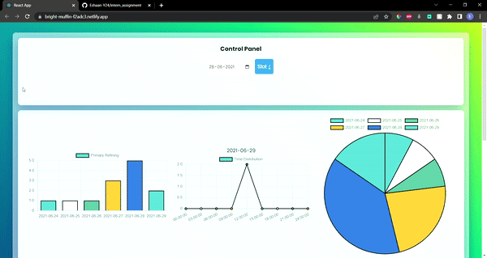

# Assignment
This is my submission for the assignment given by your team. The web app is a simple tool that queries from 4000+ element dataset, and uses Chart.JS library to display the graphical output for queries.

## Added Slot filtering along with date

Date and Slots can be Selected from the control panel, and effects the global variables for date and slot.

## Time Distribution Curve

The Second Table spits out grouped dates, which when clicked generate a table for the date to see the distribution of schedule times.
